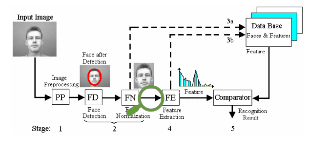
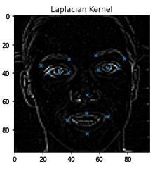
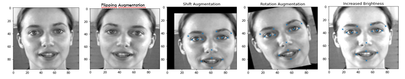
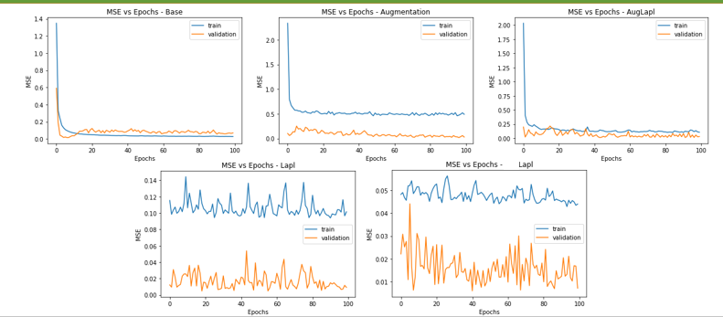

# Facial keypoints Detector

Federico Fontana - Mattia Capparella

**Laplacian  enhanced  FKpS detector**

## Overview

## Laplace operator in 2D:
It  is a second-order  differential operator,
The difference with other operators is  that  Laplacian  does not highlight edges in any  particular  direction.

## Augmentation:
The idea behind this implementation is to take care of some image variations that can occur while taking photos  
in uncontrolled conditions: when is impossible to retake an acquisition, this technique provides a generalization tool that prevent the model to overfit the data.

## Performance:
As kaggle competition

